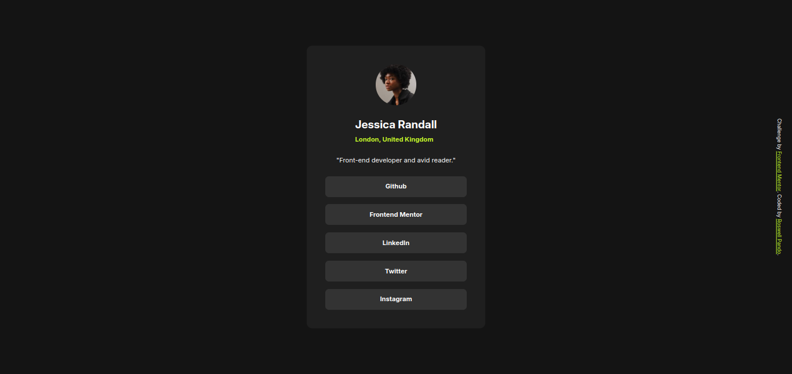

# Frontend Mentor - Social Links Profile

This is a solution to the [QR code component challenge on Frontend Mentor](https://www.frontendmentor.io/challenges/social-links-profile-UG32l9m6dQ). Frontend Mentor challenges help you improve your coding skills by building realistic projects. 

## Table of contents

- [Overview](#overview)
  - [Screenshot](#screenshot)
  - [Links](#links)
- [My process](#my-process)
  - [Built with](#built-with)
  - [What I learned](#what-i-learned)
  - [Useful resources](#useful-resources)
- [Author](#author)
- [Acknowledgments](#acknowledgments)

## Overview

### Screenshot



### Links

- Solution URL: [GitHub repository](https://github.com/welpmoz/Social-Links-Profile).
- Live Site URL: [Live site](https://welpmoz.github.io/Social-Links-Profile/)

## My process

### Built with

- Semantic HTML5 markup
- CSS custom properties
- CSS grid
- Class based CSS styles

### What I learned

I learn to use grid CSS for adapt the content to three screens. Using grid CSS, for me, is the better solution for responsive design.

Here I show how is applied responsive design with grid CSS in this project:

```css
body {
    min-height: 100vh;
    display: grid;
    justify-content: center;
    align-content: center;
    background-color: var(--grey-900);
    position: relative;
    grid-template-columns: repeat(4, 7.2rem);
    gap: 1.6rem;
}

.card {
    grid-column: 1 / 5;
    background-color: var(--grey-800);
    border-radius: 12px;
    display: flex;
    flex-direction: column;
    align-items: center;
    padding: 2.4rem;
    gap: 2.4rem;
}

@media (min-width: 920px) {
    body {
        grid-template-columns: repeat(8, 5.6rem);
        gap: 2.4rem;
    }

    .card {
        grid-column: 2 / 8;
        padding: 4rem;
    }
}

@media (min-width: 1440px) {
    body {
        grid-template-columns: repeat(12, 7.2rem);
        gap: 3.2rem;
    }

    .card {
        grid-column: 5 / 9;
    }
}
```


### Useful resources

- [W3schools](https://www.w3schools.com/howto/howto_css_transition_hover.asp): I visit this web site for learn how to use properly transitions between normal and hover state.


## Author

- Github - [Roswell Jaime](https://github.com/welpmoz)
- Frontend Mentor - [@welpmoz](https://www.frontendmentor.io/profile/welpmoz)

## Acknowledgments

I greatly appreciate the work done by the Frontend Mentor community. Their challenges are diverse and well-suited for developers at all levels. Additionally, I'm grateful for the inclusion of Figma as a useful resource.